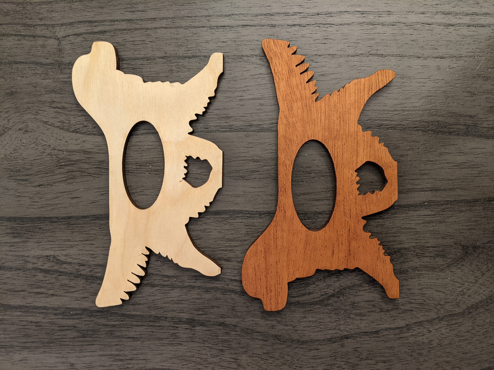

# Cavalier Napkin Rings

Purpose: A local dog charity needed items for a silent auction raising funds for a dog born with cleft pallete 
Material: quarter inch birch/mahogany double sided plywood with oil finish 
Files: SVG and Illustrator files included above

Paper prototype 
 

 
 

 
 Cut and oiled holder
 

 
 

 
 
 

 
 

 
 
 

 
 

